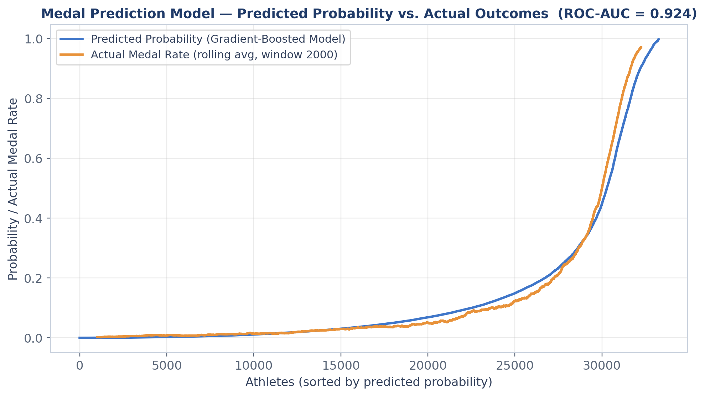

# Olympic Medal Prediction Model

A machine learning model that predicts the probability an individual Olympic athlete wins a medal, trained on 120 years of Olympic history (Summer Games, 1960–2016). Built with scikit-learn's gradient-boosted trees (`HistGradientBoostingClassifier`) and validated with a leakage-aware evaluation suite.

**Headline result: ROC-AUC 0.924 / PR-AUC 0.795 on a held-out test set of 33,254 athlete-entries** — 5.6× better than chance at a 14.2% medal base rate, with an expected calibration error of just 1.5%.

<p align="center">
  
</p>

## Problem

Given an athlete's entry in an Olympic event — who they are, what country they compete for, what event they're in — what is the probability they medal? Medals are rare (~14% of entries), so the model is evaluated with imbalance-aware metrics (PR-AUC, precision@top-k, calibration), not just accuracy or ROC-AUC.

## Model

- **Algorithm:** `HistGradientBoostingClassifier` (gradient-boosted trees), chosen over a logistic regression baseline because medal odds depend on feature *interactions* (e.g. a tall swimmer from a historically strong program in a small-field event). Upgrading lifted ROC-AUC from ~0.82 to ~0.92 on the same features.
- **Target:** binary `Medalist` flag (any medal vs. none), per athlete-entry.
- **Scope:** Summer Olympics, 1960–2016 (~166k entries after filtering).

### Features (all known before results — no outcome leakage)

| Group | Features |
|---|---|
| Athlete | Age, Height, Weight, BMI, Sex |
| Context | Country (NOC), Sport, Years since 1960 |
| Field size | Athletes per country-year, country-sport-year, event-year; athlete's event count |
| Team signal | Country's athlete count in the same event-year (relays/team sports medal whole rosters) |
| History | Prior medal rates for country, country-sport, and event — computed **only from earlier Games** via cumulative sums, so no current-year outcomes leak in |

## Results

From [`results/metric_report.txt`](results/metric_report.txt) (full report in repo):

### Held-out test set (random 80/20 split, n = 33,254)

| Metric | Model | No-skill baseline |
|---|---|---|
| ROC-AUC | **0.924** | 0.500 |
| PR-AUC | **0.795** | 0.142 (5.6× chance) |
| Brier score | **0.058** | 0.122 |
| Precision @ top 5% | **0.986** | 0.142 |
| Precision @ top 10% | **0.845** | 0.142 |
| Accuracy @ 0.5 | **0.928** | 0.858 ("predict none") |
| Expected calibration error | **0.015** | — |

The model is well-calibrated: predicted probabilities track actual medal rates across all deciles (e.g. bin predicted 0.446 → actual 0.456).

### Stress tests (leakage-safe validation)

| Validation scheme | ROC-AUC | PR-AUC |
|---|---|---|
| Random 80/20 split | 0.924 | 0.795 |
| Grouped 5-fold by athlete ID (same athlete never in train *and* test) | 0.919 ± 0.003 | 0.785 ± 0.009 |
| Temporal: train ≤ 2008, predict 2012 + 2016 (true forecasting) | 0.799 | 0.475 |

The grouped CV shows the score isn't driven by memorizing repeat athletes. The temporal split is the honest "predict a future Games" number — still 3.2× better than chance at ranking future medalists.

### What drives predictions? (ablation + permutation importance)

| Feature set | ROC-AUC | PR-AUC |
|---|---|---|
| Body/demographics only (Age, Ht, Wt, BMI, Sex, Sport) | 0.710 | 0.291 |
| Country/event context + history | 0.922 | 0.800 |
| Full model | 0.924 | 0.795 |

Top permutation importances: country (NOC, 0.154), sport (0.045), prior country-sport medal rate (0.045), prior event medal rate (0.039). **Insight: who you compete for and the program's track record matter far more than physical attributes.**

## Repository

| File | Purpose |
|---|---|
| [`olympic_medal_model.py`](olympic_medal_model.py) | Full pipeline: data cleaning, feature engineering, EDA visualizations, model training, metric panel, permutation importance |
| [`eval_metrics.py`](eval_metrics.py) | Standalone validation audit: calibration, ablations, grouped CV, temporal split, univariate AUCs |
| [`results/metric_report.txt`](results/metric_report.txt) | Complete metric output from the audit |
| [`results/`](results/) | Prediction-vs-actual figures (PNG/SVG) |
| [`noc_regions.csv`](noc_regions.csv) | NOC → country/region mapping |

## Reproducing

1. Download `athlete_events.csv` from the [120 Years of Olympic History](https://www.kaggle.com/datasets/heesoo37/120-years-of-olympic-history-athletes-and-results) Kaggle dataset and place it in the repo root (`noc_regions.csv` is already included).
2. Install dependencies and run:

```bash
pip install -r requirements.txt
python3 olympic_medal_model.py            # train model + generate all charts
python3 eval_metrics.py                   # full validation audit
```

Tested with scikit-learn 1.6, pandas 2.3, numpy 2.0.

## Beyond the model

The full analysis also explores female participation trends (1960–2016), medal efficiency per 100 athletes by country, medalist vs. non-medalist body-composition distributions by sport, and a custom **Medal Efficiency Index (MEI)** combining performance with gender parity — see the visualization sections of `olympic_medal_model.py`.

---

*Originally developed for the FBLA 2025–26 Data Analysis national competition by Sohaib Qurashi.*
